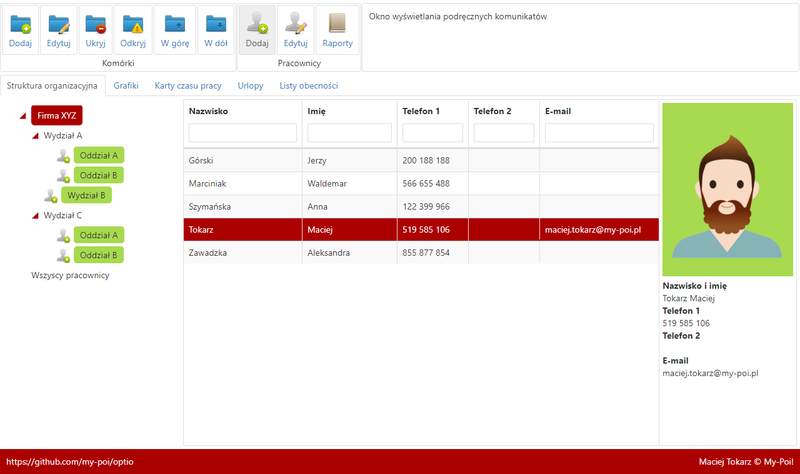
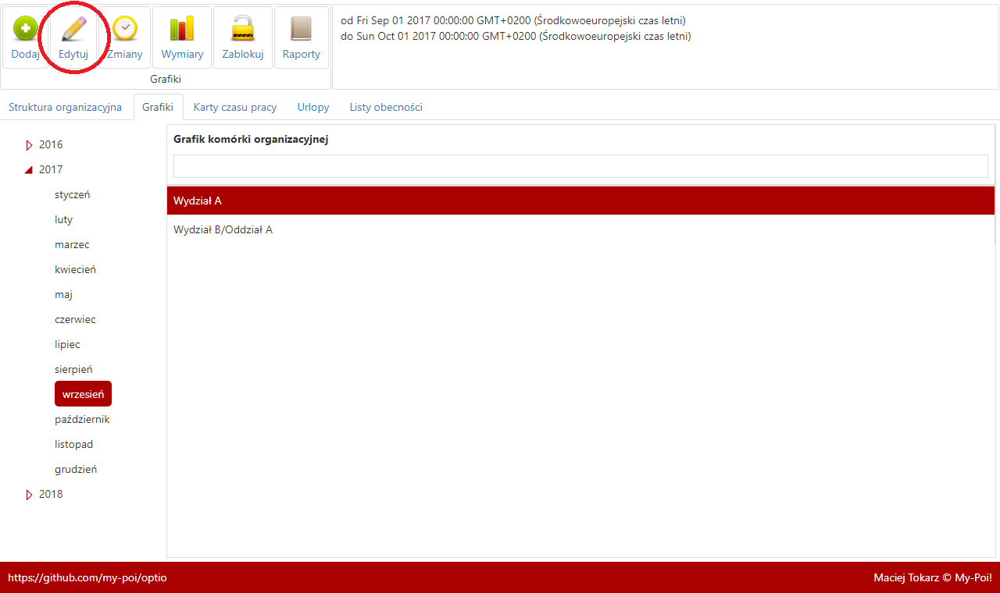
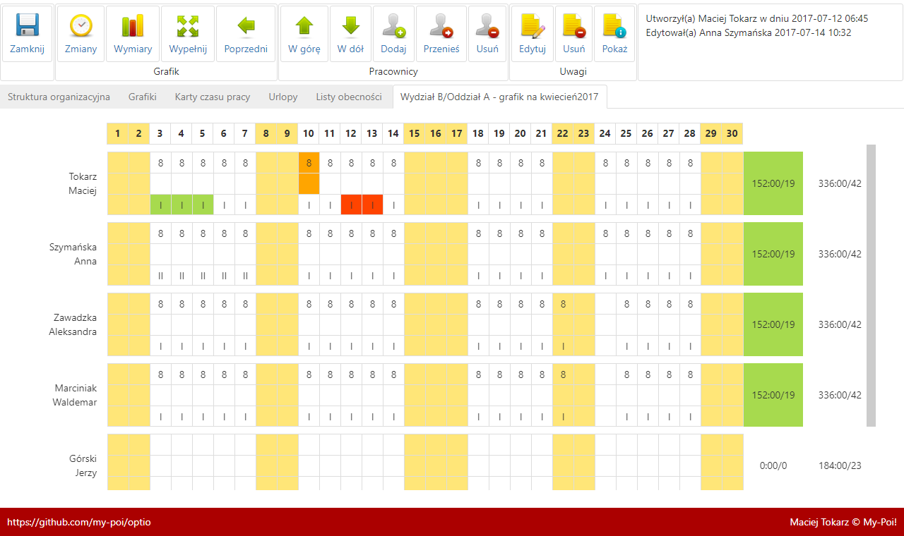
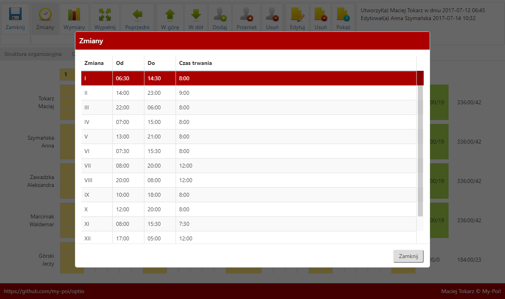
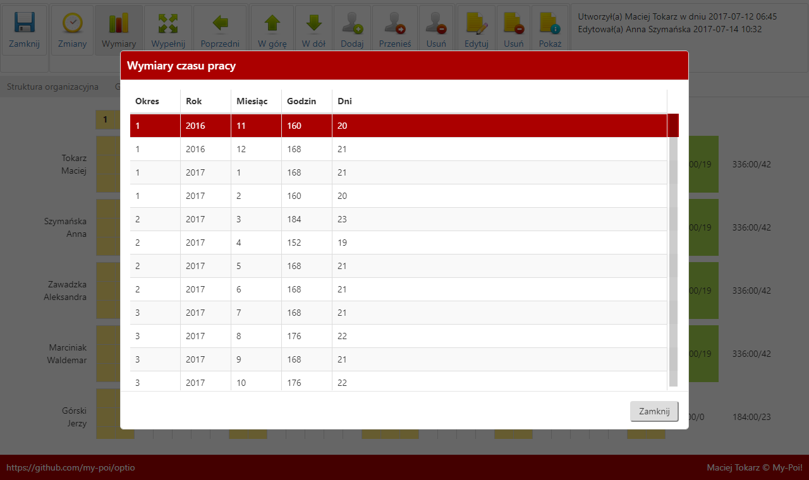
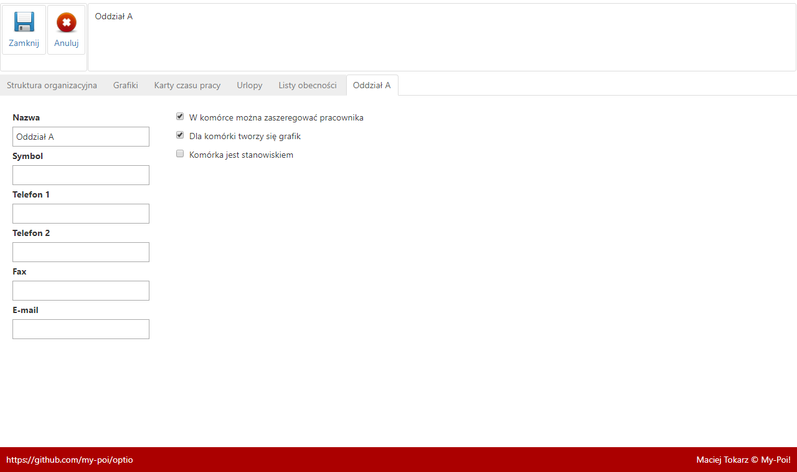

 
# Optio (łac. adiutant, asystent, pomocnik)

Projekt zawiera dwa moduły, których podstawową funkcją jest zarządzanie:
- strukturą organizacyjną
- czasem pracy

Zastosowane technologie:
- Angular
- Node.js
- MySQL Database

Uwaga: projekt zawiera komercyjne ikony [320 Vivid Web Icons](https://graphicriver.net/item/320-vivid-web-icons/1216888) pana Pawła Kadysza, których użycie wymaga zakupu stosownej licencji!

Opis podstawowych funkcjonalności:
- tworzenie i zarządzanie drzewem struktury organizacyjnej
- rozmieszczanie pracowników w strukturze
- tworzenie grafików oraz kart czasu pracy
- kontrola wykorzystania wymiaru czasu pracy
- zarządzanie urlopami
- tworzenie list obecności

[Wersja demonstracyjna](https://optio.xyz/)

Przykłady raportów:

- [grafik](https://optio.xyz/raporty/?nazwa=grafik&id=1&rok=2017&miesiac=4)

- [lista obecności](https://optio.xyz/raporty/?nazwa=lista-obecnosci&id=3&rok=2017&miesiac=4)

[Strona na Facebook-u](https://www.facebook.com/optio.xyz)

1. Struktura

2. Grafiki - po kliknięciu na wstążce polecenia "Edytuj" otworzy się przykładowy grafik jak na obrazku nr 3.

3. Przykładowy grafik

4. Wypełnienie grafiku polega wprowadzaniu w dolnym wierszu symbolu zmiany (I, II, III, IV itd. do XX) co powoduje automatyczne uzupełnienie wiersza godzin i minut według definicji danej zmiany. Po tej operacji istnieje możliwość ręcznego skorygowania czasu trwania zmiany - maksymalnie można zaplanować 12 godzin. Górny wiersz określa godziny, a środkowy minuty czasu trwania zmiany. Nie wszystkie zmiany są obowiązujące i tak bieżący wykaz posiada ważne definicje zmian od I do XIV. Przykładowa zmiana XI określa czas pracy w ilości 7 godzin i 30 minut i jej wprowadzenie obrazuje zwinność planowania czasu pracy.

5. Pozostałe zrzuty ekranu

Maciej Tokarz © My-Poi!